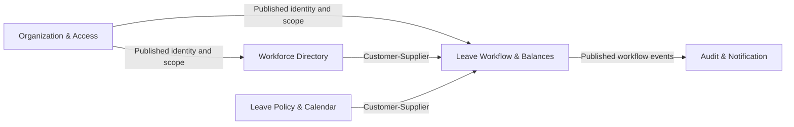

+++
slug = "employee-hub"
explore_type = "Diverge-Converge"
created = "2026-08-28"
status = "VALIDATED"
steps_completed = ["ingest-existing-docs", "capture-landscape", "extract-drivers", "model-domain", "write-architecture-context"]
source_documents = 6
evidence_coverage = "OBS-led; INF and ASM explicitly marked"
+++

# Architecture Context: Employee Hub

**Initiative**: Employee Hub  
**Status**: VALIDATED — ready for downstream solutioning after PRD  
**Approved by Sponsor**: 2026-08-28  
**Scope**: Greenfield learning project for secure, auditable employee leave management.  
**Evidence labels**: **OBS** = observed in a project artifact or confirmed by the sponsor; **INF** = inferred from multiple findings; **ASM** = an explicit assumption or unresolved choice.

## 1. Existing Architecture Baseline

**Greenfield — no existing application or architecture to baseline.** [OBS: Step 1 inventory]

The repository contains Flow discovery artifacts only. No application, schema, infrastructure definition, API specification, runbook, provider contract, binary architecture document, or prior ADR was provided. [OBS: Step 1 inventory]

| Area | Current finding | Evidence |
|---|---|---|
| Application | No implementation exists | OBS: Step 1 inventory |
| Runtime | Rancher is the target; cluster, namespace, ingress, registry, secrets, probes, rollout, rollback, and backup capabilities are unknown | OBS: [Technical Feasibility](technical-feasibility.md#5-technical-risks-and-unknowns) |
| Technology direction | Angular; NestJS/TypeScript; PostgreSQL; npm; separate frontend and backend apps in one repository | OBS: [Context](context.md), [Technical Feasibility](technical-feasibility.md#1-system-context) |
| Integrations | Identity and notification providers are not selected; calendar, HRIS, payroll, and collaboration integrations are deferred | OBS: Technical Feasibility |
| Legacy/debt | No inherited debt; avoid unpinned tooling, UI-only authorization, mutable balances, and missing idempotency | OBS: Technical Feasibility |

Existing decisions extracted: **0 ADRs**. [OBS]

## 2. Landscape Assessment

| ID | Current answer | Source | Evidence |
|---|---|---|---|
| AQ-001 Business driver | Operational efficiency and clear leave workflow | [Context](context.md) | OBS |
| AQ-002 Release timeline | No committed deployment date; Explore runs through 2026-10-08 but this is not a production-release commitment | Explore Bundle; sponsor | OBS |
| AQ-004 Scale | Initial learning scenario: 10 employees; concurrent-user, request-rate, and 2× growth targets are open | Sponsor | OBS / ASM |
| AQ-005 Peaks | Holiday seasons concentrate requests and approvals; magnitude is unmeasured | Sponsor | OBS / ASM |
| AQ-006 Data ownership/residency | Application owns fictional workforce, policy, request, balance, decision, audit, and notification-intent data. Identity and delivery will be external once selected. No residency requirement. | Technical Feasibility; sponsor | OBS |
| AQ-007 Consistency | Commands affecting request, balance, breakdown, and audit require one atomic committed result. Notification delivery may be eventual. | Technical Feasibility | OBS |
| AQ-008 Integrations | No external integration is required for MVP; identity and notification are future dependencies | Context; Technical Feasibility | OBS |
| AQ-009 Unknown integrations | Provider contracts are unknown because providers are unselected | Technical Feasibility | OBS |
| AQ-010 Technology constraints | Angular, NestJS TypeScript, Node LTS, PostgreSQL, npm, Rancher, modular monolith, fixed roles; exact versions and IdP are open | Context; sponsor | OBS |
| AQ-011 Compliance | No GDPR or formal certification scope; practical least privilege, data minimization, auditability, and secure transport remain quality safeguards | Sponsor; Technical Feasibility | OBS |
| AQ-012 Risk preference | Prefer proven, well-documented approaches where they meet the need | Sponsor | OBS |

| Maturity dimension | Level | Evidence |
|---|---|---|
| Architecture governance | Emerging, sponsor-led; Andrei is Product Manager and Architect, sponsor is Lead Engineer | OBS: Context |
| Technology adoption | Proven-choice preference within a modern TypeScript web stack | OBS: AQ-010, AQ-012 |
| Operational readiness | Emerging; CI, registry, observability, identity, notification, and Rancher details are not confirmed | OBS: Technical Feasibility |
| Delivery practice | Incremental, evidence-driven Flow process; application work has not started | OBS: Explore Bundle |
| Platform maturity | Unknown; Rancher is a deployment target, not verified environment capability | OBS / ASM |

Key stakeholders: Sponsor/Lead Engineer (technical and delivery choices); Andrei as Product Manager (scope/outcomes) and Architect (review); future HR-domain reviewer (policy/calculation validation). [OBS: Context, Domain Analysis]

## 3. Architecture Drivers

### Ranked Driver Matrix

| Rank | Driver | Type | Impact | Uncertainty | Tension with | Source | Evidence |
|---|---|---|---|---|---|---|---|
| 1 | Correct, atomic leave-request, balance, and audit outcome | Quality / functional | High | High | Implementation simplicity | Technical Feasibility; Domain Analysis | OBS |
| 2 | Organization isolation and fixed-role server authorization | Security / constraint | High | Medium | Fast client-only delivery | Context; Technical Feasibility | OBS |
| 3 | Explainable working-day calculation | Quality / functional | High | Medium | Simplified date handling | Domain Analysis; Technical Feasibility | OBS |
| 4 | Immutable audit history and balance reconciliation | Quality / functional | High | Medium | Mutable CRUD convenience | Domain Analysis; Technical Feasibility | OBS |
| 5 | Mandated TypeScript web stack and modular-monolith scope | Technology / constraint | High | Low | Tooling freedom | Context; sponsor | OBS |
| 6 | Safe behavior under retries and concurrent commands | Resilience / quality | High | High | Minimal persistence design | Technical Feasibility | OBS |
| 7 | Rancher target with unknown environment capabilities | Delivery / platform | High | High | Early deployment claims | Technical Feasibility | OBS / ASM |
| 8 | Responsive, keyboard-accessible browser workflow | Accessibility / quality | Medium | Medium | Rapid UI delivery | Technical Feasibility | OBS |

### Functional Drivers

| Driver | Priority | Complexity | Uncertainty | Dependencies | Evidence |
|---|---|---|---|---|---|
| Employee profile, balance, request status, and eligible cancellation | MUST | Medium | Medium | Identity, workforce data, effective policy | OBS |
| Request submission with server-calculated working days and balance effect | MUST | High | High | Policy/calendar/schedule, concurrency, authorization | OBS |
| Manager one-step approval/rejection for direct reports | MUST | High | High | Manager relationship, lifecycle, authorization | OBS |
| HR management of workforce, policies, holidays, history, and business audit | MUST | High | Medium | Workforce/policy data, scoped access | OBS |
| Administrator organization access/configuration and security review | MUST | Medium | High | Identity/account model, audit | OBS |
| Immutable audit and balance-ledger history | MUST | High | Medium | Transaction approach and retention | OBS |
| Workflow notifications | SHOULD | Medium | Medium | Durable intent, provider, retry | OBS |
| Team availability with minimum necessary detail | SHOULD | Medium | High | Visibility rules | OBS |

### Quality Attributes

| Attribute | Current measurable target / verification | Owner | Trade-off | Evidence |
|---|---|---|---|---|
| Correctness | One final decision, coherent balance effect, breakdown, and audit record; prove with transaction/concurrency tests | Lead Engineer | More persistence/test complexity | OBS |
| Security | Every access scoped by authenticated identity, active role, and organization; negative authorization tests | Lead Engineer / Architect | More API/query discipline | OBS |
| Performance | Learning environment: scoped reads p95 <500 ms; critical commits p95 <1 s; default lists ≤50 records | Lead Engineer | Measurement effort | OBS |
| Resilience | Commands need committed server response; notification uses durable intent and retry evidence | Lead Engineer | Job/outbox complexity | OBS |
| Auditability | Sensitive actions and balance changes are traceable; ledger/projection is reconcilable | Lead Engineer / HR reviewer | Storage/query growth | OBS |
| Accessibility | Semantic keyboard flow, readable errors, 4.5:1 text contrast, 44×44 CSS-pixel touch targets | Product Manager / Lead Engineer | UI implementation/test effort | OBS |
| Maintainability | TDD, explicit supported versions, modular boundaries, automated workflow coverage | Lead Engineer | Setup time | OBS |
| Operations | No uptime, RPO/RTO, backup/restore, or alerting target is defined; no claim before evidence | Sponsor / runtime owner | Release confidence | OBS / ASM |

### PoC Candidates

| Candidate | Why validation is needed | Priority | Evidence |
|---|---|---|---|
| PostgreSQL transaction, migration, locking/versioning, and idempotency approach | Prove one final decision and one balance effect under retry/concurrency | High | OBS |
| Identity-provider and account-linking model | Prove secure identity, organization scope, and fixed-role mapping | High | OBS |
| Rancher deployment prerequisites | Verify actual runtime capability before a deployment claim | High | OBS |

## 4. Domain Model Sketch

The detailed model and glossary remain authoritative in [Domain Analysis](domain-analysis.md) and [Shared Glossary](../glossary.md). This is the architecture-relevant ownership and consistency view only. [OBS]

| Bounded context | Responsibility | Data owned | Evidence |
|---|---|---|---|
| Organization & Access | Establish organization scope and fixed role assignments | Organization, UserAccount, RoleAssignment | OBS |
| Workforce Directory | Maintain employee, team, manager, and schedule structure | Employee, Team, WorkSchedule | OBS |
| Leave Policy & Calendar | Maintain types, policies, calendars, and holidays | LeaveType, LeavePolicy, HolidayCalendar, PublicHoliday | OBS |
| Leave Workflow & Balances | Process request lifecycle and balance effects | LeaveRequest, RequestDayBreakdown, ApprovalDecision, LeaveBalance, BalanceTransaction | OBS |
| Audit & Notification | Preserve traceability and communicate outcomes | AuditEvent, Notification | OBS |

| Aggregate root | Invariants and lifecycle | Events / evidence |
|---|---|---|
| Organization Access | Active organization scope; explicit roles; no implicit inheritance | Organization/role changes are auditable [OBS] |
| Employee | One organization; manager relationship and work schedule are organizational data | Workforce changes affect future eligibility [INF] |
| Leave Policy / Holiday Calendar | Draft, active, retired configuration; prior requests must not be silently reinterpreted | Configuration change is auditable [OBS] |
| Leave Request | Pending → Approved, Rejected, or Cancelled; one final immutable decision; approved may be eligible for cancellation | Submitted, approved, rejected, cancelled [OBS] |
| Leave Balance | Ledger and projection reconcile; no duplicate effect | Reserve/use/release semantics require validation [OBS / ASM] |

No new glossary terms were discovered. [OBS]

## 5. Constraints Register

| # | Constraint | Type | Classification | Source | Evidence |
|---|---|---|---|---|---|
| C-01 | Angular frontend and NestJS/TypeScript backend, as separate apps in one repository | Technology | Hard | Context; sponsor | OBS |
| C-02 | Node LTS, npm, PostgreSQL, and Rancher deployment target | Technology / platform | Hard | Context; sponsor | OBS |
| C-03 | Modular-monolith scope; no broad HR-platform expansion | Scope | Hard | Signal; Context | OBS |
| C-04 | One local organization initially; API and persistence preserve organization boundaries | Data / security | Hard | Context | OBS |
| C-05 | Fixed roles and one manager approval step for MVP | Functional | Hard | Context | OBS |
| C-06 | Fictional data only; no payroll, recruiting, performance, or legal-compliance features | Data / scope | Hard | Signal; Context | OBS |
| C-07 | Server authorization, least privilege, organization isolation, auditable sensitive actions, and secure transport outside local development | Security | Hard | Technical Feasibility | OBS |
| C-08 | Critical commands have transaction, concurrency, and idempotency protection | Data consistency | Hard | Technical Feasibility; Domain Analysis | OBS |
| C-09 | Date-only, explainable working-day calculation with policy/schedule/holiday evidence | Domain / quality | Hard | Domain Analysis; Technical Feasibility | OBS |
| C-10 | Prefer proven, well-documented approaches | Technology choice | Soft | Sponsor | OBS |
| C-11 | Responsive, keyboard-accessible browser UX | Accessibility | Soft | Technical Feasibility | OBS |
| C-12 | Provisional p95 reads <500 ms and critical commits <1 s | Performance | Soft | Technical Feasibility | OBS |
| C-13 | Notification is separate from committed workflow state and may be eventual | Resilience | Soft | Technical Feasibility | OBS |
| C-14 | Exact versions and browser matrix need a deliberate scaffold decision | Delivery | Soft | Technical Feasibility | OBS |
| C-15 | No formal GDPR/certification or data-residency requirement is in learning scope | Regulatory | Soft | Sponsor | OBS |
| C-16 | Deployment timing, providers, CI/registry, observability, backup/recovery, and scale are unresolved | Delivery / operations | Soft | Landscape; Technical Feasibility | OBS / ASM |
| C-17 | Assumptions are 10 employees and holiday-season peaks | Scale | Soft | Sponsor | OBS |

## 6. Open Questions

| # | Question | Owner | Priority | Impact if unresolved | Source step |
|---|---|---|---|---|---|
| OQ-01 | Which identity provider, protocol, token/session model, and account-linking rules will be used? | Lead Engineer | High | Secure authentication and role/scope mapping cannot be validated | 2 / 3 |
| OQ-02 | Which ORM/migration tool, transaction boundary, locking/versioning method, and idempotency strategy prove balance invariants? | Lead Engineer | High | Duplicate or inconsistent leave effects | 3 / 4 |
| OQ-03 | Which supported versions of Node, Angular, NestJS, TypeScript, PostgreSQL, Docker, Vitest, Jest, and Supertest are pinned? | Lead Engineer | High | Scaffold and CI are not reproducible | 2 / 3 |
| OQ-04 | What Rancher runtime capabilities and ownership model are available? | Sponsor / runtime owner | High | Deployment design and learning outcome cannot be validated | 2 / 3 |
| OQ-05 | Which GitHub organization, repository, Actions runner, registry, secrets, branch rules, and review conventions apply? | Sponsor / Lead Engineer | High | CI/CD workflow is blocked | 2 / 3 |
| OQ-06 | How are effective policy, schedule, and holiday versions retained for historical requests? | Lead Engineer / Architect | High | Calculations/audit may be reinterpreted | 3 / 4 |
| OQ-07 | What leave visibility and self-approval behavior is acceptable? | Product Manager / HR reviewer | High | Authorization and UX are ambiguous | 4 |
| OQ-08 | Which leave types, overlap, edit/cancel, balance-adjustment, and time-zone rules are MVP policy? | Product Manager / HR reviewer | High | Acceptance criteria are incomplete | 4 |
| OQ-09 | Which notifications, logs, metrics, traces, alerts, and sensitive-data rules apply? | Product Manager / Lead Engineer | Medium | Jobs and operations are incomplete | 2 / 3 |
| OQ-10 | What load, availability, recovery, retention, and accessibility targets apply? | Sponsor / Lead Engineer | Medium | Quality claims cannot be assessed | 2 / 3 |

## Solutioning Readiness Summary

### Available for Solutioning

- [x] Greenfield baseline and inventory
- [x] Landscape assessment with every AQ answered or explicitly open
- [x] Ranked drivers and quality guardrails
- [x] Bounded-context and aggregate sketch
- [x] Hard/soft constraints register
- [x] Open-question handoff

### Priorities to Address First

1. Prove leave-request, balance, approval, and audit invariants under concurrency and retry.
2. Establish organization-scoped authentication and authorization without trusting client scope.
3. Keep working-day calculation date-only, explainable, and historically reproducible.
4. Honor the Angular/NestJS/PostgreSQL modular-monolith direction with pinned supported versions.
5. Verify Rancher/GitHub/CI/registry/observability prerequisites before environment-dependent commitments.

### Risks Carried Forward

Identity, persistence/concurrency tooling, configuration snapshots, runtime access, GitHub workflow, provider contracts, observability, and acceptance targets require explicit validation or decisions in later Explore and Govern work. [ASM]

## Related Artifacts

- [Signal](../../signal/signals/20260827-employee-hub-leave-management.md)
- [Explore Bundle](explore-bundle.md)
- [Context](context.md)
- [Market Research](market-research.md)
- [Domain Analysis](domain-analysis.md)
- [Technical Feasibility](technical-feasibility.md)
- [Shared Glossary](../glossary.md)

**Last Updated**: 2026-08-28  
**Status**: VALIDATED — ready for downstream solutioning after PRD
