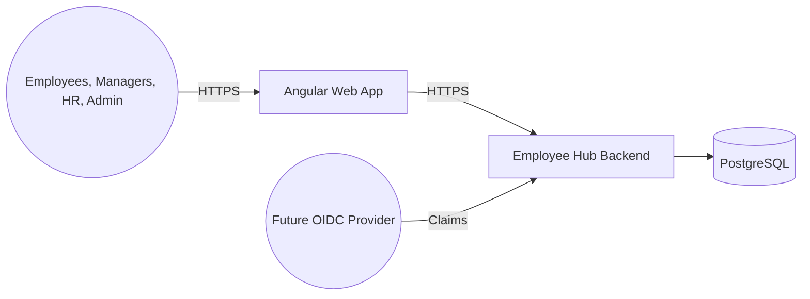

# Employee Hub — High-Level Design

**Slug**: `employee-hub`  
**Version**: 0.1  
**Status**: SOCIALIZATION-READY  
**Date**: 2026-09-01

| Version | Date | Author | Changes | Reviewed By |
| --- | --- | --- | --- | --- |
| 0.1 | 2026-09-01 | Explore Agent | Initial B.2 draft | — |

## 1. System Overview

Employee Hub is a greenfield, fictional-data leave-management system for Employees, Managers, HR, and Administrators. It supports explainable leave requests, one manager decision, controlled configuration/balance adjustment, and immutable audit history. `[OBS: R-001–R-017]` Payroll, recruitment, performance, and formal-compliance features are excluded. `[OBS]`

## 2. Architecture Approach

One deployable NestJS modular monolith owns five bounded contexts: Access, Workforce, Policy & Calendar, Workflow & Balances, and Audit & Notification. `[OBS: DEC-007, DEC-008]` PostgreSQL is the sole transactional store. `[OBS: DEC-012]` Internal module APIs and post-commit milestones replace distributed services or a broker. `[OBS: DEC-015]`

## 3. Component Breakdown

| Component | Responsibility | Does not own | PRD |
| --- | --- | --- | --- |
| Access | Scope, accounts, roles, authorization | Workforce/workflow data | R-009, R-017 |
| Workforce | Employee, team, manager, schedule | Policy or balances | R-011 |
| Policy & Calendar | Types, policies, holidays | Request state | R-012, R-013 |
| Workflow & Balances | Preview, requests, decisions, ledger | Authorization/configuration | R-002–R-008, R-014 |
| Audit & Notification | Audit, outbox, delivery status | Business state mutation | R-010, R-016 |

## 4. Integration & Data Flows

Authenticated HTTP is the primary trigger. `[OBS]` Submit/decide/cancel/adjust commands atomically persist business state, balance evidence, audit event, and outbox intent; worker delivery occurs later. `[OBS: NFR-008–010]` Identity and Rancher contracts remain provisional (BLK-001, BLK-002); module/API schemas need creation (BLK-003).

## 5. Key Architectural Decisions

See accepted [ADR-001](../decisions/employee-hub-adr-001-typeorm-postgresql-migrations.md), [ADR-002](../decisions/employee-hub-adr-002-idempotency-versioning-locks.md), [ADR-003](../decisions/employee-hub-adr-003-provider-neutral-identity-adapter.md), [ADR-004](../decisions/employee-hub-adr-004-transactional-outbox-worker.md), [ADR-005](../decisions/employee-hub-adr-005-calculation-breakdown-version-references.md), and [ADR-006](../decisions/employee-hub-adr-006-explicit-fixed-role-permission-matrix.md). `[OBS: DEC-012–017]`

## 6. Technology Stack

Angular frontend, NestJS/TypeScript backend, Node LTS, npm, PostgreSQL, TypeORM, Docker local environment, and Rancher target. `[OBS: constraints; DEC-012]` Exact supported versions and runtime provider remain `[ASM]` and must be pinned before scaffold/CI (NFR-019).

## 7. Security Considerations

All protected operations derive server-side identity, organization scope, and explicit permissions. `[OBS: R-009, NFR-004–007]` No client scope is trusted; cross-organization, self-approval, and immutable-ledger/audit mutation are rejected and audited. `[OBS: DEC-017]` Only fictional/minimized data is permitted. `[OBS: NFR-006]`

## 8. Quality Attributes & Operational Requirements

Commands target p95 <1s and bounded reads p95 <500ms in the initial profile. `[OBS: NFR-001–003]` Idempotency, versions, locks, atomic transaction, and immutable evidence protect correctness. `[OBS: NFR-008–011; DEC-013]` Accessible responsive critical flows target WCAG 2.2 AA learning evidence. `[OBS: NFR-013–015]`

## 9. Scalability & Performance

Use organization-scoped indexed queries, deterministic pagination, and a maximum default list size of 50. `[OBS: NFR-003]` The initial 10-employee load does not justify cache, broker, or microservices. `[INF]` Scale only after measured need.

## 10. Deployment Architecture

Docker supports local development. Rancher is the intended shared-runtime target, but namespace, ingress, registry, secrets, probes, rollout, backup, and ownership are `[ASM]` (BLK-002). No availability/RPO/RTO claim is made (NFR-012).

## 11. Monitoring & Observability

Provide health/readiness, structured safe logs, correlation IDs across HTTP and worker paths, metrics, and traces; exclude prohibited data. `[OBS: NFR-020]` Alert/platform choices remain `[ASM]` pending runtime facts.

## 12. Future-State Experience Journey

The target experience gives Employees one route to preview, submit, track, and cancel leave; Managers decide scoped requests; HR configures workforce/policy/balances; Admin explicitly manages access and security. `[OBS: F1–F9; PRD]` The detailed future journey will be updated after this HLD is approved. `[OBS]`

## 13. Open Questions

| Open item | Owner | Target resolution |
| --- | --- | --- |
| OIDC provider/claims and account linking | Lead Engineer | Before non-stub authentication implementation. |
| Supported versions | Lead Engineer | Before scaffold/CI. |
| Rancher/GitHub delivery capability | Sponsor/runtime owner | Before shared deployment. |
| Leave policy, Manager visibility, and absence routing | Product Manager / future HR reviewer | Before related feature implementation. |

These items remain explicit in the boundary map and blocker register. `[OBS]`

## 14. Enrichment Log

| Date | Change | Source |
| --- | --- | --- |
| 2026-09-01 | Initial draft from approved B.1 design sketch. | Architecture Solutioning B.2 |
