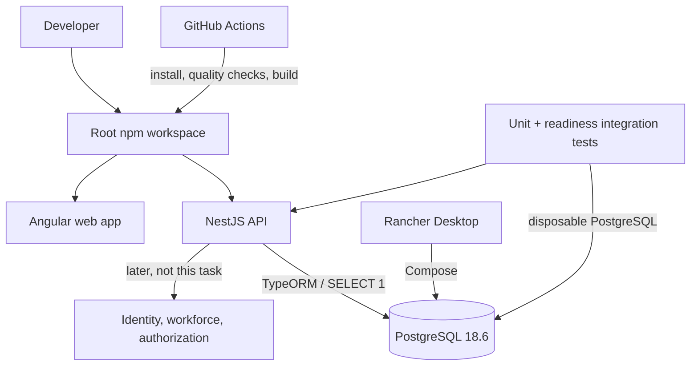

# Architectural Context: EH0002

## Component Diagram

## Components Involved

- **Root npm workspace:** owns shared commands and workspace discovery; does not host business code.
- **Angular web app:** separate generated frontend application with Vitest baseline; it has no Employee Hub feature UI in this increment.
- **NestJS API:** separate generated backend application; owns configuration validation, TypeORM initialization, and live/readiness endpoints only.
- **PostgreSQL:** local Compose service executed through Rancher Desktop; later becomes the transactional store selected in ADR-001.
- **GitHub Actions:** executes quality evidence only; it has no deployment, registry, or environment-secret responsibility.

## Integration Points

- **API to PostgreSQL:** TypeORM data source verifies a configured connection; readiness performs a safe `SELECT 1`; automatic schema synchronization is disabled.
- **Rancher Desktop to PostgreSQL:** runs the version-pinned Compose configuration locally; it is not a substitute for the unresolved Rancher shared-runtime contract.
- **GitHub Actions to workspace:** invokes the same deterministic install and quality commands documented for local contributors.

## Test Boundaries

- **Unit tests:** Angular and NestJS generated/testable components are isolated; external database behavior is mocked or excluded.
- **Integration tests:** NestJS starts with disposable real PostgreSQL and proves safe readiness success/failure behavior.
- **E2E tests:** no business E2E flow exists for this scaffold; later E1–E6 tasks own workflow-level Playwright coverage.
- **Smoke tests:** health endpoints are suitable for local and later deployment probes, but this task does not deploy them.

## Downstream Impacts

- **E1 secure workforce work:** gains a version-pinned API, PostgreSQL migration path, test baseline, and safe configuration foundation for the provider-neutral identity stub and authorization modules.
- **E2–E6 work:** gains repeatable root quality commands and a database foundation without inheriting premature business schema or domain APIs.
- **Delivery work:** gains GitHub Actions quality evidence; image publishing, Rancher manifests, secrets, deployment, and observability remain separately task-gated.
