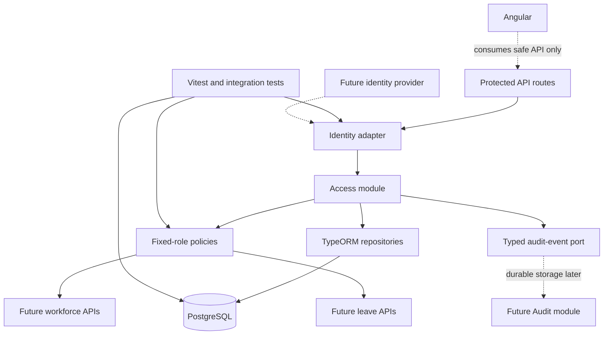

# Technical Implementation Plan: EH0003

## 1. Overview

Employee Hub needs a server-owned identity and authorization boundary before
employee or organization information is exposed. This increment implements the
first Access boundary in the NestJS modular monolith using fictional local
identities, PostgreSQL-backed account and workforce relationships, and explicit
fixed-role policies.

This plan consolidates the planning evidence:

- [Problem](working/03-problem.md)
- [Goals and constraints](working/04-goals.md)
- [Research](../../../../work/05-research.md)
- [Technical approach](../../../../work/07-technical-approach.md)
- [Pipeline tests](../../../../work/08-pipeline-tests.md)
- [Architecture](../../../../work/09-architecture.md)
- [Acceptance criteria](../../../../work/10-acceptance-criteria.md)
- [Risks](../../../../work/11-risks.md)
- [Sequencing](../../../../work/12-sequencing.md)

## 2. Requirements and Traceability

The task addresses EH-E1 Secure Workforce Foundation, especially R-001, R-009,
R-011, R-017, NFR-004, NFR-005, NFR-006, NFR-011, NFR-018, and NFR-020.

The implementation must:

- Resolve valid fictional identities to one active server-owned account,
  organization, fixed role, and permitted employee context.
- Enforce Employee, Manager, HR, and Administrator permissions on the server.
- Enforce organization ownership, field-appropriate access, and direct-report
  scope; client-provided organization or role values are never authoritative.
- Reject absent, malformed, invalid, expired, unlinked, inactive,
  cross-organization, and role-inappropriate requests safely.
- Preserve correlation and sanitized actor/outcome evidence through a typed
  audit-event port.
- Use fictional/minimized data only and keep the local identity override out of
  production.

Explicitly excluded are real provider integration, local passwords, dynamic
roles, leave calculations/workflows, durable audit storage and audit screens,
Angular feature UI, deployment, and production operations.

## 3. Decisions and Constraints

### Identity

Follow [ADR-003](../../../../explore/decisions/employee-hub-adr-003-provider-neutral-identity-adapter.md):
use a signed-token-shaped provider-neutral adapter and a fictional local/test
override. Provider-specific claim mapping and credentials remain behind the
adapter and are not selected here.

### Authorization

Follow [ADR-006](../../../../explore/decisions/employee-hub-adr-006-explicit-fixed-role-permission-matrix.md):
use explicit fixed-role permissions. Administrator access is represented by
individual permissions, not a superuser bypass. Self-approval and immutable
audit/ledger mutation are always denied.

### Persistence

Use TypeORM migrations and PostgreSQL, preserving [ADR-001](../../../../explore/decisions/employee-hub-adr-001-typeorm-postgresql-migrations.md)
and compatibility with [ADR-002](../../../../explore/decisions/employee-hub-adr-002-idempotency-versioning-locks.md).
Automatic schema synchronization remains disabled.

### Existing foundation

EH0002 supplies the NestJS, TypeORM, PostgreSQL, Vitest, CI, and verification
baseline. Its Dava.Flow completion state must be reconciled before EH0003
implementation handoff.

## 4. Architecture

The Access module owns identity resolution, account/role lookup, organization
scope, and policy evaluation. Workforce and leave modules consume the resolved
context rather than creating independent authorization logic. Angular may use
the safe API result for presentation but cannot grant access.

## 5. Data Model and Migrations

Create the minimum authoritative records:

- `Organization`: scoped-record owner; active state and fictional display data.
- `UserAccount`: provider-neutral subject link, organization, active state, and
  safe account metadata.
- `RoleAssignment`: account-to-fixed-role relation for Employee, Manager, HR,
  or Administrator, with active state and uniqueness rules.
- `Employee`: organization-owned workforce identity with optional account link,
  active state, and one effective manager employee relation.

Required safeguards:

- Foreign keys and uniqueness for organization/account/role relationships.
- Same-organization enforcement for account and employee relationships.
- Rejection of duplicate, self, cyclic, inactive, and cross-organization
  manager links.
- Explicit TypeORM migrations and no synchronization.
- No leave, balance, notification, or durable audit tables in this task.

## 6. Identity and Authorization Design

### Identity flow

1. The request adapter reads the signed-token-shaped identity contract or the
   explicitly enabled non-production/test override.
2. It validates required subject and token lifecycle fields.
3. The Access module resolves the subject to one active `UserAccount`.
4. Server-owned organization, role, employee, and manager context is loaded.
5. A normalized access context is attached to the request for policy evaluation.

Reject absent, malformed, invalid, expired, unlinked, inactive, or ambiguous
identities without exposing provider details or account existence.

### Permission policy

Define the E1 matrix for the four fixed roles and identity/profile/workforce
proof capabilities only. Every matrix entry has an allowed and denied test.
Manager subject access additionally requires an active direct-report relation in
the same organization. Leave capabilities are unavailable until their owning
tasks exist.

### Safe errors and audit events

Use stable error codes, safe messages, correlation IDs, and permitted next-action
context. Never return stack traces, credentials, tokens, provider details, or
unauthorized record-existence information.

Emit a typed audit event for security-sensitive allowed and denied outcomes. The
event contract contains allow-listed actor, organization, target, action,
outcome, time, and correlation facts. Durable persistence is a later Audit task.

## 7. API Surface

Add a minimal protected `GET /api/v1/access/me` endpoint. It returns the safe
resolved account, organization, fixed role, and permitted employee context with
a correlation identifier.

Add a small protected `/api/v1/access/policy-fixture` surface solely to prove
the policy matrix through HTTP integration tests. It must not become a business
API or expose arbitrary records. No employee-management or leave route belongs
in EH0003.

## 8. Implementation Sequence

### Phase 1 — Foundation

1. Confirm EH0002 readiness and existing module/test patterns.
2. Define normalized identity, access-context, permission, error, and audit
   event contracts.
3. Add entities, repositories, migrations, fixtures, and relationship guards.

### Phase 2 — Core boundary

4. Implement the adapter and isolated local/test identity override.
5. Implement account, organization, role, employee, and manager resolution.
6. Implement explicit fixed-role and direct-report policies.
7. Add the protected access-context and policy-proof routes.

### Phase 3 — Integration and evidence

8. Add correlation propagation and typed audit-event emission.
9. Add unit, HTTP, and disposable-PostgreSQL integration tests.
10. Run complete verification and update traceability documentation.

Identity contract tests and policy unit tests can proceed in parallel after their
shared contract is defined. Migration constraint tests and event-shaping tests
can also proceed in parallel after their contracts exist.

## 9. Test Inventory

### Unit

- Identity mapping and lifecycle validation.
- Fixed-role positive and negative permission matrix.
- Organization and direct-report scope predicates.
- Safe error construction and audit-event sanitization.

### Integration

- Real TypeORM migrations against disposable PostgreSQL.
- Account, role, employee, manager, uniqueness, and same-organization rules.
- Valid, absent, invalid, expired, unlinked, and inactive identities.
- Cross-organization, unrelated-report, self, inactive, and cyclic cases.

### HTTP and smoke

- `GET /api/v1/access/me` with a valid fictional identity.
- Policy fixture route for allowed and denied E1 permissions.
- Verify status codes, safe fields, correlation IDs, no leakage, and no
  mutation.

### Fuzz and CI

- Fuzz identity headers/tokens and client-supplied scope values.
- Exclude health endpoints and shared-environment use of the local override;
  verify the override is unavailable in production.
- Run the existing root format, lint, type-check, test, and build verification
  in GitHub Actions for pull requests and pushes to `master`.

## 10. Risks and Mitigations

| Risk | Mitigation |
|---|---|
| Claim mapping or local override becomes unsafe | Narrow adapter contract, non-production guard, lifecycle tests. |
| Cross-organization or role bypass | Central server-owned scope, explicit policies, complete negative matrix. |
| Manager data leakage | Same-organization direct-report predicates and adversarial tests. |
| Administrator bypasses safeguards | Explicit permissions and immutable-action denial tests. |
| Invalid relationship schema | Database constraints, migrations, and integration tests. |
| Audit evidence is unsafe or incomplete | Typed allow-listed event contract and sanitization tests. |
| EH0002 workflow state remains inconsistent | Reconcile Dava.Flow state before implementation handoff. |

## 11. Sizing

The accepted sizing is documented in [size.md](size.md):

- **Complexity:** 7/18
- **Shirt size:** S
- **Estimate:** 2–3 focused development days
- **Confidence:** Medium

The estimate assumes EH0002's existing foundation is available, the task stays
limited to the E1 access proof boundary, and real provider, durable audit,
leave, UI, and deployment work remain deferred.

## 12. Definition of Done

- All acceptance criteria in [working/10-acceptance-criteria.md](../../../../work/10-acceptance-criteria.md)
  pass.
- Unit, HTTP, and disposable-PostgreSQL tests pass through root verification.
- Migrations run from a clean database with synchronization disabled.
- No production path enables the fictional identity override.
- Positive and negative role/organization/manager tests are present.
- Safe errors and typed audit events are verified for sensitive outcomes.
- Documentation links, task metadata, and implementation evidence are updated.
- No real data, secrets, external provider integration, deployment configuration,
  or out-of-scope leave functionality is committed.
