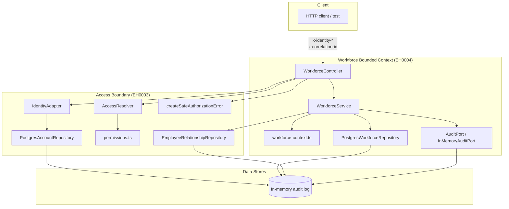

# Implementation Plan: EH0004 — Implement workforce and reporting-line administration

## Task Definition Reference

**Task ID**: EH0004
**Status**: 02-planning
**Phase**: govern
**Planner**: andrei_vasiloi@yahoo.com

### Problem Statement

EH-E1 has a working identity and fixed-role authorization boundary from EH0003,
but no workforce capability yet. HR cannot maintain employee, team, or manager
reporting-line records, and employees have no profile data. Without this
foundation, later leave requests, approvals, and availability views have no
eligible actors or organizational context to act on.

### Goals

- Introduce a Workforce bounded context alongside the existing Access context.
- Provide HR with safe, organization-scoped APIs to create, view, update,
  activate, and deactivate fictional Employee and Team records.
- Enforce single active manager per employee, same-organization scope, and
  rejection of self, cyclic, inactive, duplicate, and cross-organization
  reporting lines.
- Ensure every workforce mutation is attributable and emits audit evidence
  through the existing `AuditPort`.
- Register and apply the new TypeORM migration(s) in local development and CI.

### Constraints

- Extend the existing NestJS ESM app (`apps/api/src`), TypeORM, PostgreSQL,
  Vitest + Supertest + Testcontainers stack.
- Preserve `synchronize: false` and use explicit migrations (ADR-001).
- Reuse `AccessContext`, `E1Permission`/`FixedRole` matrix, and `AuditPort`
  contracts from EH0003 rather than duplicating them.
- Employee creation requires an existing, linked `user_accounts` row in the same
  organization.
- Fictional/minimized data only; no real employee data, secrets, or credentials.

### Non-Goals

- Leave policies, balances, previews, requests, approvals, or notifications.
- Dynamic roles or configurable permissions.
- External identity-provider or payroll/HRIS integration.
- Durable/queryable audit storage (EH0006 will supply this later).
- Account-less Employee creation / pre-onboarding flow.
- UI/UX beyond the server-side API boundary.

## Related Work

### Applicable Architecture Decisions

| Decision ID | Status | Key Requirement | Link |
|---|---|---|---|
| ADR-001 | Accepted | TypeORM + PostgreSQL, explicit migrations, `synchronize: false` | [employee-hub-adr-001-typeorm-postgresql-migrations.md](../../../explore/decisions/employee-hub-adr-001-typeorm-postgresql-migrations.md) |
| ADR-003 | Accepted | Provider-neutral identity adapter; EH0004 only consumes `AccessContext` | [employee-hub-adr-003-provider-neutral-identity-adapter.md](../../../explore/decisions/employee-hub-adr-003-provider-neutral-identity-adapter.md) |
| ADR-006 | Accepted | Explicit fixed-role permission matrix (Employee/Manager/HR/Administrator) | [employee-hub-adr-006-explicit-fixed-role-permission-matrix.md](../../../explore/decisions/employee-hub-adr-006-explicit-fixed-role-permission-matrix.md) |

### Related Tasks

| Task ID | Status | Relationship | Link |
|---|---|---|---|
| EH0002 | Completed | Provides the NestJS/TypeORM/Vitest scaffold | [task.md](../../06-completed/EH0002-scaffold-employee-hub-applications-and-local-quali/task.md) |
| EH0003 | Completed | Provides `AccessContext`, `AuditPort`, `PostgresAccountRepository`, `EmployeeRelationshipRepository` | [task.md](../../06-completed/EH0003-implement-provider-neutral-identity-and-fixed-role/task.md) |
| EH0005 | Pending planning | Blocked by EH0004; consumes employee/profile records | [task.md](../../01-pending-planning/EH0005-implement-employee-profile-and-leave-summary/task.md) |
| EH0006 | Pending planning | Blocked by EH0004/EH0003; will persist `AuditPort` events | [task.md](../../01-pending-planning/EH0006-implement-durable-audit-storage/task.md) |

### Source Documents

- [EH-E1 Secure Workforce Foundation](../../../explore/epics/EH-E1-secure-workforce-foundation.md)
- [R-011 Workforce and reporting-line administration](../../../explore/prds/employee-hub-prd.md#L146)
- [PRD Data model](../../../explore/prds/employee-hub-prd.md#L384)
- [HLD Component Breakdown](../../../explore/hlds/employee-hub-hld.md#L45-L51)
- [HLD Boundary Map](../../../explore/hlds/employee-hub-boundary-map.md#L27)
- [HR Employee edit flow](../../../explore/domain/flows-employee-hub.md#L183-L206)

## Technical Approach

### High-Level Strategy

EH0004 introduces a new `workforce` bounded context in `apps/api/src/workforce`.
It builds directly on the EH0003 access layer (`AccessContext`, fixed-role
permissions, `AuditPort`, `PostgresAccountRepository`, and
`EmployeeRelationshipRepository`) and adds PostgreSQL-backed repositories for
Employee and Team administration. The implementation keeps the same raw-SQL,
migration-driven, `synchronize: false` persistence style used by EH0003.

All endpoints derive organization scope from the server-side `AccessContext`;
no client-supplied `organizationId` is trusted.

### Architecture Decisions

#### Decision 1: New `workforce` folder/module, separate from `access`

- **Choice**: Add `apps/api/src/workforce/` containing controller, service,
  repository, context types, and a new TypeORM migration.
- **Rationale**: Matches the HLD's separate Workforce bounded context and keeps
  EH0003's authorization surface untouched.
- **Alternatives considered**: Extend `AccessController` — rejected because it
  would mix authorization and workforce responsibilities.

#### Decision 2: Reuse existing `AccessContext`, permissions, and `AuditPort`

- **Choice**: Use `IdentityAdapter` + `PostgresAccountRepository` +
  `AccessResolver` to obtain `AccessContext`, check `hasPermission` /
  `canAccessOrganization`, and emit audit events through the existing
  `AuditPort`/`InMemoryAuditPort` contract.
- **Rationale**: No new permission constants are required (`workforce:manage`,
  `workforce:read:organization` already exist in `permissions.ts`).
- **Alternatives considered**: Introduce a new `WorkforceAuditPort` — rejected
  because the existing event shape already contains the required fields.

#### Decision 3: Reuse `EmployeeRelationshipRepository.assignManager` for manager assignment

- **Choice**: Import `EmployeeRelationshipRepository` from `access` and call
  its `assignManager` method from a dedicated
  `POST /api/v1/workforce/employees/:id/manager` endpoint.
- **Rationale**: The repository already contains the exact transactional guard
  set R-011 requires (self, duplicate, inactive, cross-organization via
  composite FK, and cycle detection with `FOR UPDATE` locks).
- **Alternatives considered**: Duplicate the cycle/lock logic in a new
  `workforce` repository — rejected to avoid drift.

#### Decision 4: Manager assignment is a separate endpoint, not part of Employee creation

- **Choice**: `POST /employees` creates an Employee without a manager.
  `POST /employees/:id/manager` assigns or reassigns the manager using
  `EmployeeRelationshipRepository.assignManager`.
- **Rationale**: `assignManager` manages its own `queryRunner` transaction.
  Running the insert and assignment as separate calls avoids refactoring the
  repository to accept an external `queryRunner`. R-011 only requires "at most
  one active Manager," not manager-at-creation.
- **Alternatives considered**: Allow `managerEmployeeId` on creation and wrap
  insert + assignment atomically — rejected because it complicates the
  transaction boundary.

#### Decision 5: Add `teams` table and extend `employees` with `team_id`, `display_name`, and `version`

- **Choice**: Create a new migration `1710000000001-CreateWorkforceSchema`
  that:
  - Adds `teams` table: `id`, `organization_id`, `name`, `active`, `version`.
  - Alters `employees` to add `team_id` (nullable composite FK to `teams`),
    `display_name` (varchar 120), and `version` (integer default 0).
  - Adds a composite unique `(id, organization_id)` on `employees`.
  - Replaces `fk_employees_manager` with a composite
    `(manager_employee_id, organization_id) -> (employees.id, organization_id)` FK.
- **Rationale**: The PRD data model states `Employee` belongs to exactly one
  `Team` and may reference one Manager. Composite FKs extend the same-
  organization protection already used for `employees.account_id` in EH0003.
- **Alternatives considered**: Enforce team/manager organization scope only in
  application code — rejected because EH0003 demonstrates the value of DB-level
  invariants.

#### Decision 6: Optimistic concurrency with integer `version`

- **Choice**: Every `PATCH` and soft-deactivate must include an
  `expectedVersion`. The repository increments `version` only when the row's
  current version matches; otherwise it throws a 409 conflict.
- **Rationale**: The HR edit domain flow explicitly requires stale updates to
  be "refreshed and reconciled rather than silently overwritten."
- **Alternatives considered**: Last-write-wins or timestamp-based concurrency —
  rejected because they do not provide deterministic conflict detection.

#### Decision 7: Set `migrationsRun: true` in the runtime `DataSource`

- **Choice**: Change `apps/api/src/database/database.provider.ts` from
  `migrationsRun: false` to `migrationsRun: true` so the application applies
  pending migrations on `DataSource.initialize()`.
- **Rationale**: EH0003's implementation summary lists as a known limitation that
  the access migration is "present but is not yet registered in the application's
  runtime database configuration." Without this change, neither the EH0003 nor
  EH0004 migration would be applied in the running app or in container-based
  integration tests.
- **Alternatives considered**: Add a separate `npm run db:migrate` script —
  rejected as additional complexity for the learning-project scope; can be
  revisited when Rancher deployment automation is implemented.

#### Decision 8: Manual DTO validation, no new dependencies

- **Choice**: Use TypeScript interfaces/classes for DTOs and perform explicit
  validation in `WorkforceService`. Return stable 400 errors without leaking
  internal details.
- **Rationale**: `class-validator` is not currently a dependency, and adding it
  would require package-lock changes.
- **Alternatives considered**: Add `class-validator` and `ValidationPipe` —
  rejected to keep the dependency footprint minimal and consistent with EH0003.

### Component Changes

- `apps/api/src/workforce/workforce-context.ts` — Domain and command/DTO
  types (`WorkforceEmployee`, `WorkforceTeam`, `CreateEmployeeCommand`,
  `UpdateEmployeeCommand`, `AssignManagerCommand`, `CreateTeamCommand`,
  `UpdateTeamCommand`, `ListOptions`).
- `apps/api/src/workforce/workforce.repository.ts` — `PostgresWorkforceRepository`
  with raw-SQL CRUD for teams and employees, organization scoping, and
  optimistic concurrency.
- `apps/api/src/workforce/workforce.service.ts` — Orchestrates validation,
  repository calls, manager relationship calls, and audit events.
- `apps/api/src/workforce/workforce.controller.ts` — NestJS controller for
  `/api/v1/workforce/*`, resolves `AccessContext`, enforces permissions.
- `apps/api/src/app.module.ts` — Register `WorkforceController` and
  `WorkforceService`.
- `apps/api/src/database/database.provider.ts` — Set `migrationsRun: true`.
- `apps/api/src/database/migrations/1710000000001-CreateWorkforceSchema.ts` —
  New TypeORM migration.

### Data Model

```text
organizations (existing)
  └─ user_accounts (existing)
  └─ role_assignments (existing)
  └─ employees
       + display_name: varchar(120)
       + team_id: varchar nullable -> teams(id, organization_id)
       + version: integer default 0
       ~ manager_employee_id FK becomes composite (manager_employee_id, organization_id)
         -> employees(id, organization_id)
       + unique (id, organization_id)
  └─ teams (new)
       - id: varchar PK
       - organization_id: varchar -> organizations(id)
       - name: varchar(120)
       - active: boolean default true
       - version: integer default 0
       - unique (organization_id, name)
       - unique (id, organization_id) for composite FK target
```

### API Design

Organization scope is derived from `AccessContext`. The API never trusts a
client `organizationId`.

| Endpoint | Method | Permission | Purpose |
|---|---|---|---|
| `/api/v1/workforce/employees` | `POST` | `workforce:manage` | Create employee |
| `/api/v1/workforce/employees` | `GET` | `workforce:read:organization` | List employees |
| `/api/v1/workforce/employees/:id` | `GET` | `workforce:read:organization` | Get employee |
| `/api/v1/workforce/employees/:id` | `PATCH` | `workforce:manage` | Update employee |
| `/api/v1/workforce/employees/:id/manager` | `POST` | `workforce:manage` | Assign/reassign manager |
| `/api/v1/workforce/teams` | `POST` | `workforce:manage` | Create team |
| `/api/v1/workforce/teams` | `GET` | `workforce:read:organization` | List teams |
| `/api/v1/workforce/teams/:id` | `GET` | `workforce:read:organization` | Get team |
| `/api/v1/workforce/teams/:id` | `PATCH` | `workforce:manage` | Update team |

Request/response examples:

**Create Employee**
```json
POST /api/v1/workforce/employees
{
  "accountId": "account-001",
  "displayName": "Jane Doe",
  "teamId": "team-001"
}
```

```json
201 Created
{
  "id": "employee-001",
  "accountId": "account-001",
  "organizationId": "organization-001",
  "displayName": "Jane Doe",
  "teamId": "team-001",
  "managerEmployeeId": null,
  "active": true,
  "version": 0,
  "correlationId": "corr-001"
}
```

**Update Employee / Team**
```json
PATCH /api/v1/workforce/employees/:id
{
  "displayName": "Jane Doe",
  "teamId": "team-002",
  "active": true,
  "expectedVersion": 0
}
```

**Assign Manager**
```json
POST /api/v1/workforce/employees/:id/manager
{
  "managerEmployeeId": "employee-002"
}
```

Pagination defaults: `limit` 50 (capped at 50), `offset` 0.

### Error Handling

| Scenario | HTTP | Safe response |
|---|---|---|
| Missing/invalid identity | 401 | `INVALID_IDENTITY` + `correlationId` |
| Missing/wrong permission or organization | 403 | `ACCESS_DENIED` + `correlationId` |
| Invalid referenced account/team/manager | 400 | Stable message, no record-existence leakage |
| Manager relationship guard violation | 400 | Stable message from `EmployeeRelationshipRepository` |
| Stale `expectedVersion` | 409 | "Resource was modified by another request" |
| Resource not found in caller's organization | 404 | Standard safe 404 |

### State Management

- No hard deletes; `active` flag controls soft activation/deactivation.
- Optimistic concurrency via `version`; writes require `expectedVersion`.
- Audit events appended via `AuditPort.emit` for every successful mutation.
- Same-organization invariant enforced by composite FKs and application checks.

### Architectural Context



### Integration Points

- `IdentityAdapter` — validates header lifecycle claims.
- `PostgresAccountRepository` + `AccessResolver` — resolves `AccessContext`.
- `hasPermission` / `canAccessOrganization` — enforces fixed-role and
  organization scope.
- `EmployeeRelationshipRepository` — assigns managers with transactional guard
  logic.
- `AuditPort` — emits sanitized workforce mutation events.
- `DataSource` — connection and transaction runner.

### Configuration

- No new environment variables.
- `migrationsRun: true` in the runtime `DataSource`.
- Pagination defaults: `limit` 50, `offset` 0.

### Dev Hints

- Reuse the `PostgreSqlContainer('postgres:18.6-alpine')` pattern from
  `access.spec.ts` for repository and API integration tests.
- For controller API tests, use
  `Test.createTestingModule({ imports: [AppModule] }).overrideProvider(DataSource).useValue(dataSource).compile()`.
- Run root quality checks with the existing `npm run ...` commands defined in
  the workspace `package.json`.
- When adding the migration, import both `CreateAccessSchema1710000000000` and
  `CreateWorkforceSchema1710000000001` into tests so the disposable database
  starts from a clean, fully migrated state.

## Test Inventory

### Pipeline / Smoke Tests

Post-deployment happy-path validation:

| Endpoint | Method | Scenario | Expected |
|---|---|---|---|
| `/api/v1/workforce/teams` | `POST` | HR creates a team. | `201` with `id`, `name`, `active: true`, `version: 0`. |
| `/api/v1/workforce/teams` | `GET` | HR lists teams. | `200` with paginated organization-scoped list. |
| `/api/v1/workforce/employees` | `POST` | HR creates an employee linked to an active account. | `201` with employee record. |
| `/api/v1/workforce/employees` | `GET` | HR lists employees. | `200` with paginated organization-scoped list. |
| `/api/v1/workforce/employees/:id` | `GET` | HR fetches a created employee. | `200` with record and `correlationId`. |
| `/api/v1/workforce/employees/:id` | `PATCH` | HR updates team with valid `expectedVersion`. | `200` with updated `teamId` and `version + 1`. |
| `/api/v1/workforce/employees/:id/manager` | `POST` | HR assigns and reassigns a manager. | `200` with `managerEmployeeId` updated. |

### Fuzz / Negative Tests

- Reference data: seeded organization with HR, manager, and employee accounts;
  one active team.
- No excluded endpoints; all `/api/v1/workforce/*` endpoints are fuzzed.
- Invalid inputs: empty/too-long `displayName`, non-UUID/missing/foreign-org
  `accountId`/`teamId`/`managerEmployeeId`, malformed `expectedVersion`,
  out-of-range pagination.
- Manager-specific negatives: self, duplicate, cyclic (depth > 1), inactive,
  cross-organization.
- Ensure no stack traces, DB errors, or record-existence leakage.

### Integration Tests

| Scenario | Focus |
|---|---|
| Employee lifecycle | Create → update team → assign manager → deactivate → reactivate. |
| Manager relationship guards | Self, duplicate, cyclic, inactive, cross-org rejections. |
| Cross-organization isolation | HR from org A cannot read/write org B resources. |
| Optimistic concurrency | Second update with stale version returns 409. |
| Audit event emission | Every mutation emits one structured `AuditPort` event. |
| Clean migrations | Fresh PostgreSQL container applies both migrations successfully. |

### Acceptance Criteria

See `working/10-acceptance-criteria.md` for the full set. The plan covers:

- Happy path: create/view/update/activate/deactivate Employee and Team.
- Error handling: 401, 403, 400, 404, 409 with safe stable messages.
- Edge cases: pagination cap, team deactivation does not cascade, cyclic
  manager chains, inactive account rejection.
- Integration: audit events, clean migrations, cross-org isolation, quality
  gate pass.

## Risk Assessment

| Risk | Category | Likelihood | Impact | Mitigation |
|---|---|---|---|---|
| Altering existing `employees` table / replacing FK breaks existing environments. | Data Model | Medium | High | Include all schema changes in `CreateWorkforceSchema1710000000001`; test clean-slate and incremental migration paths. |
| `assignManager` manages its own `queryRunner`; cannot wrap create + assign atomically. | Transaction | Medium | Medium | Scope manager assignment as a dedicated endpoint; no manager-at-creation. |
| Deep recursive CTE cycle detection with `FOR UPDATE` could contend. | Performance | Low | Medium | Cap recursion depth; test deep-but-acyclic chains. |
| In-memory `AuditPort` loses evidence on restart until EH0006. | Operations | Medium | High | Document known limitation; EH0006 will swap adapter. |
| `expectedVersion` conflicts require client retry. | UX | Low | Medium | Return 409 stable message; document in API tests. |
| Team deactivation does not deactivate employees may surprise downstream. | Data Model | Low | Medium | Explicit assumption; integration test validates independence. |
| Cross-org isolation relies on composite FKs and app checks. | Security | Low | High | Every new FK is composite; add cross-org isolation tests. |
| Incorrect permission reuse could allow unauthorized mutation. | Security | Low | High | Permission matrix tests for each role on every endpoint. |

## Dependencies

### Blocking

- **EH0002** — NestJS/TypeORM/PostgreSQL scaffold.
- **EH0003** — `AccessContext`, permissions, `AuditPort`, `PostgresAccountRepository`,
  `EmployeeRelationshipRepository`.

### Dependent

- **EH0005** — consumes `employees`, `teams`, and manager relationships.
- **EH0006** — persists `AuditPort` events emitted here.

## Implementation Strategy

### Phase 1: Foundation — Schema and Shared Contracts

- Create `CreateWorkforceSchema1710000000001` migration (`teams` table,
  `employees` extensions, composite FKs).
- Set `migrationsRun: true` in `database.provider.ts`.
- Add `workforce-context.ts` and `workforce.repository.ts`.

### Phase 2a: Team CRUD Endpoints

- Implement service methods and controller routes for teams.
- Enforce `workforce:manage` / `workforce:read:organization`.
- Emit `AuditPort` events.

### Phase 2b: Employee CRUD Endpoints

- Implement service methods and controller routes for employees.
- Validate `accountId` and optional `teamId` are in the same organization.
- Emit `AuditPort` events.

### Phase 2c: Manager Reporting-Line Endpoint

- Add `POST /api/v1/workforce/employees/:id/manager`.
- Wire `EmployeeRelationshipRepository.assignManager`.
- Emit `AuditPort` events for manager assignment/reassignment.

### Phase 3: Registration, Tests, and Quality

- Register `WorkforceController` and `WorkforceService` in `AppModule`.
- Add unit and API integration tests with `PostgreSqlContainer`.
- Run root `format`, `lint`, `type-check`, `test`, and `build` commands.
- Update `task.md` status and move to `work/03-pending-implementation/`.

## Definition of Done

- All acceptance criteria in `working/10-acceptance-criteria.md` are testable
  and covered by automated tests.
- `plan.md` and `task.md` are product-readable and technical details are
  separated correctly.
- Root quality commands pass.
- Code is committed to the planning branch and a merge request is created.

## Next Steps After This Plan

1. Step 14 — Size the task using `govern.util.task-sizing`.
2. Step 15 — Finalize the task and obtain approval.
3. Step 16 — Commit the plan and create the implementation merge request.
