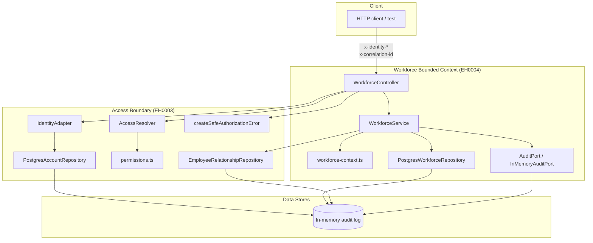

# Architectural Context

## Component Diagram

## Components Involved

- **Client**: Any HTTP consumer (tests, a future UI, or curl). Sends identity
  and correlation headers and JSON payloads; never sends an `organizationId`.
- **IdentityAdapter**: Extracts and validates the provider-neutral identity
  headers. Reused unchanged from EH0003.
- **PostgresAccountRepository**: Resolves an account from the identity subject.
  Reused unchanged from EH0003.
- **AccessResolver / permissions.ts**: Produces `AccessContext` and checks
  `workforce:*` permissions and `canAccessOrganization`. Reused unchanged.
- **EmployeeRelationshipRepository**: Provides the transactional
  `assignManager` guard. Reused from EH0003.
- **WorkforceController**: New NestJS controller owning the `/api/v1/workforce/*`
  routes. Validates headers, resolves access context, and delegates to the
  service.
- **WorkforceService**: New domain service. Validates commands, orchestrates
  repository calls, and emits audit events.
- **PostgresWorkforceRepository**: New raw-SQL repository for `employees` and
  `teams`. Enforces optimistic concurrency and organization scoping.
- **workforce-context.ts**: New domain types and command/DTO shapes.
- **AuditPort / InMemoryAuditPort**: Existing EH0003 event sink. Workforce
  mutations append structured events; durable persistence is EH0006.
- **PostgreSQL**: Stores `organizations`, `user_accounts`, `role_assignments`,
  `employees`, `teams`, and future profile/leave data.

## Integration Points

- **HTTP API**: `GET/POST/PATCH` on `/api/v1/workforce/employees` and `/teams`.
- **AccessContext resolution**: controller uses `IdentityAdapter` +
  `PostgresAccountRepository` + `AccessResolver` on every request.
- **Permission enforcement**: `workforce:manage` for writes,
  `workforce:read:organization` for reads.
- **Manager relationship validation**: `WorkforceService` calls
  `EmployeeRelationshipRepository.assignManager`, which uses a transaction and
  `FOR UPDATE` locks to detect cycles and invariants.
- **Audit emission**: every successful mutation calls `AuditPort.emit` with
  actor, organization, target, action, outcome, correlation, and timestamp.
- **Database persistence**: `PostgresWorkforceRepository` and
  `EmployeeRelationshipRepository` share the same `DataSource` and schema.
- **Migration ordering**: `CreateWorkforceSchema1710000000001` depends on
  `CreateAccessSchema1710000000000`.

## Test Boundaries

- **Unit Tests**: `WorkforceService` and `PostgresWorkforceRepository` with a
  mocked `DataSource` and injected test `AuditPort`. Focus on validation,
  optimistic concurrency, and query behavior.
- **Integration Tests**: `Test.createTestingModule({ imports: [AppModule] })`
  with a `PostgreSqlContainer` and `overrideProvider(DataSource)`. Exercise
  the full request pipeline: HTTP → controller → service → repository → DB.
- **E2E / Post-deployment smoke tests**: Not required for EH0004; smoke-test
  scenarios are covered by integration tests against a disposable database.

## Downstream Impacts

- **EH0005 (employee profile and leave summary)**: consumes `employees`,
  `teams`, and manager relationships created by EH0004. The `team_id` and
  `manager_employee_id` columns are the primary upstream data contract.
- **EH0006 (durable audit storage)**: replaces the in-memory `AuditPort` with
  a persisted adapter. EH0004 event shape must remain stable.
- **Future manager/self-service reads**: `workforce:read:direct-reports` will
  read from the reporting lines EH0004 establishes.
- **Future notifications / availability**: will rely on active/inactive flags
  and team membership managed here.
