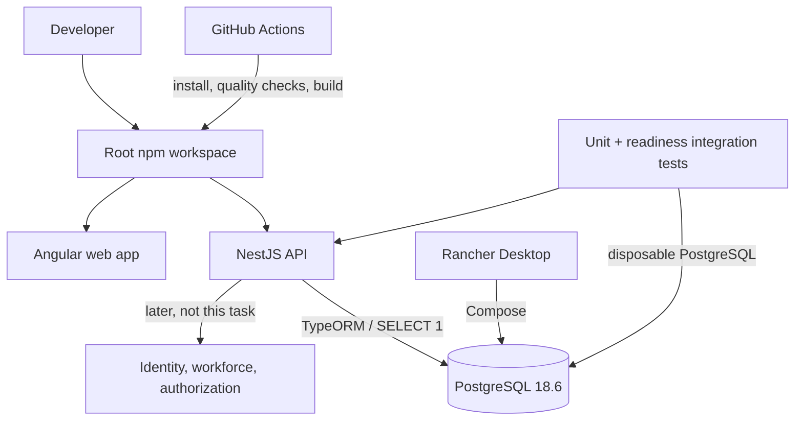

# Technical Plan: EH0002 — Scaffold Employee Hub applications and local quality baseline

## 1. Overview

Employee Hub has approved requirements and architecture but no runnable codebase. This task creates the version-pinned local foundation required before E1 workforce and authorization work: separate Angular and NestJS applications, a PostgreSQL service run through Rancher Desktop, safe health/readiness behavior, repeatable quality commands, and GitHub Actions evidence.

**Epic:** [EH-E1 Secure Workforce Foundation](../../../explore/epics/EH-E1-secure-workforce-foundation.md) — enables its supported-version/scaffold dependency only.  
**Task definition:** [task.md](task.md)  
**Planning evidence:** [working/](working/)

## 2. Scope

### In scope

- Root npm workspace with `apps/web` and `apps/api`.
- Node.js `24.20.0` LTS, Angular 22, NestJS `12.0.1`, PostgreSQL `18.6`, TypeORM `1.1.0`, and committed lockfiles.
- Angular CLI/Vitest frontend baseline and strict NestJS/Vitest backend baseline.
- PostgreSQL-only Compose configuration run through Rancher Desktop.
- Validated API configuration, TypeORM migration infrastructure with `synchronize: false`, and live/readiness endpoints.
- Root quality commands and a least-privilege GitHub Actions workflow for pull requests and pushes to `master`.
- Documentation, example configuration, fictional/empty-data boundary, and clean-checkout evidence.

### Explicitly out of scope

- Identity provider, authentication, role enforcement, workforce/profile features, audit business events, or any Employee Hub business API.
- Employee Hub business entities, fixtures, migrations, or leave workflows.
- Rancher shared-cluster manifests, image publishing, registry access, deployment credentials, observability platform, and production claims.
- E2E business journeys, performance, DAST, and authorization-matrix testing.

## 3. Governing Decisions and Constraints

| Source | Constraint applied by this plan |
|---|---|
| [EH-E1](../../../explore/epics/EH-E1-secure-workforce-foundation.md) | Deliver a reproducible scaffold without pretending to complete authorization or workforce capability. |
| [ADR-001](../../../explore/decisions/employee-hub-adr-001-typeorm-postgresql-migrations.md) | Use PostgreSQL, TypeORM, explicit migration tooling, and no automatic synchronization. |
| [ADR-002](../../../explore/decisions/employee-hub-adr-002-idempotency-versioning-locks.md) | Do not add business idempotency, locks, or schema prematurely; preserve compatibility for later work. |
| [ADR-003](../../../explore/decisions/employee-hub-adr-003-provider-neutral-identity-adapter.md) | Do not choose or integrate a real provider; leave the application ready for a later local identity stub. |
| [ADR-005](../../../explore/decisions/employee-hub-adr-005-calculation-breakdown-version-references.md) | Do not create calculation or historical-evidence schema in the scaffold. |
| [Test strategy](../../../explore/explore-employee-hub/test-strategy.md) | Use Vitest plus Angular Testing Library for web and Vitest/Supertest/Testcontainers PostgreSQL for API evidence; only fictional/empty data. The backend runner is updated during implementation because NestJS 12 is ESM and its generator defaults to Vitest. |
| [DevOps strategy](../../../explore/explore-employee-hub/devops-strategy.md) | Add GitHub Actions quality evidence without deployment permissions; apply the Sponsor decision that the default branch is `master`. |

## 4. Target Architecture



## 5. Technical Approach

### 5.1 Repository structure

Create the following minimum structure; retain generator-managed files where possible:

```text
apps/
  web/                         # Angular 22 application
  api/                         # strict CommonJS NestJS 12 application
infra/
  compose.yaml                 # PostgreSQL 18.6 only
  .env.example                 # non-secret local database defaults
.github/workflows/
  quality.yml                  # pull request + master quality evidence
.nvmrc                         # 24.20.0
package.json                   # npm workspaces + root commands
README.md                      # first local setup and verification path
```

Runtime environment files are ignored. A root or API-local `.env.example` may document variable names and non-secret local values, but no runtime `.env`, credentials, tokens, or real employee data is committed.

### 5.2 Tooling and application generation

1. Pin Node `24.20.0` in `.nvmrc`, `package.json` engines, and GitHub Actions.
2. Create the root npm workspace and root scripts that delegate to the web/API workspaces. Use `npm ci` for deterministic installs.
3. Generate the Angular 22 web app in `apps/web` using current CLI defaults, retaining the Angular-supported Vitest test setup.
4. Generate a strict NestJS `12.0.1` app in `apps/api`, retaining the NestJS 12 Vitest/ESM test setup.
5. Do not add `packages/shared` or business modules. Add shared code only when a later task has a concrete boundary and owner.

### 5.3 Database, configuration, and API health

1. Add `infra/compose.yaml` with only `postgres:18.6-alpine`, a named persistent volume, a health check, and environment-derived local values.
2. Document Rancher Desktop Compose start/stop/log commands. Web/API run as host npm processes, never as Compose services in this increment.
3. Add API configuration validation for database host, port, name, user, and password. Validation failures must not print sensitive values.
4. Configure TypeORM/`@nestjs/typeorm` for PostgreSQL with migration paths and `synchronize: false`; add no entities or business migrations.
5. Implement `GET /health/live` independently of PostgreSQL and `GET /health/ready` by executing a bounded `SELECT 1` through the configured database connection.
6. Return a stable non-sensitive `200` live/ready response and a stable non-sensitive `503` not-ready response. Do not expose URLs, hosts, ports, users, errors, stack traces, or driver details.

### 5.4 Quality commands and CI

Expose documented root commands for:

- clean install;
- web/API development;
- format check and formatting;
- lint;
- type-check;
- unit tests;
- readiness integration tests;
- production builds;
- combined verification command.

Add `.github/workflows/quality.yml` triggered by `pull_request` and `push` to `master`. It checks out the repository, sets Node `24.20.0`, uses npm caching, performs deterministic install, then runs the root format-check, lint, type-check, unit/integration test, and production-build commands. It has read-only/default minimal permissions and no secrets, deployment, registry, or Rancher steps.

## 6. Implementation Sequence

### Phase 1 — Workspace foundation

1. Add root workspace metadata, Node pins, ignore rules, basic documentation, and safe examples.
2. Generate Angular and NestJS applications in their defined paths.
3. Normalize root command names and verify format/lint/type-check/test/build commands locally.

### Phase 2 — Local database and readiness

1. Add the Rancher Desktop PostgreSQL Compose configuration and document the local workflow.
2. Add API configuration validation and TypeORM migration/data-source infrastructure.
3. Add live/readiness endpoints and their unit/integration tests using disposable PostgreSQL.

### Phase 3 — Quality evidence

1. Add/align the GitHub Actions workflow with root commands and `master` triggers.
2. Verify clean-checkout setup and quality commands.
3. Run secret/configuration review; preserve scope boundary and link evidence in the task.

Angular and NestJS generation may run in parallel after root workspace decisions are applied. CI may be drafted after command names are stable but must be verified only after Phases 1–2 pass.

## 7. Test Inventory

| Layer | Scenario | Evidence |
|---|---|---|
| Web unit | Generated Angular baseline tests execute through root command. | Vitest/Angular test result. |
| API unit | Live/readiness response mapping is stable and contains no sensitive details. | Vitest tests. |
| API integration | Disposable PostgreSQL reachable: API readiness is `200`. | Vitest + Testcontainers or CI service container. |
| API integration | Database unavailable: readiness is `503` and has no host/port/user/password/URL/stack/driver detail. | Vitest + controlled unavailable configuration. |
| Migration/config | TypeORM data source/migration command works with `synchronize: false` and no business schema. | Command/test output. |
| Workspace verification | Clean checkout installs and runs format, lint, type-check, unit tests, and production builds. | Local and GitHub Actions logs. |
| Smoke | `GET /health/live` is `200`; `/health/ready` is `200` only when database is available. | API smoke output. |
| Security/config | No secret or runtime `.env` file is committed; examples and failed-readiness response are safe. | Repository/secret scan and review. |

No fuzz testing or business E2E test is required. Health endpoints accept no business payload and are excluded from fuzzing in this increment.

## 8. Acceptance Criteria

1. A clean checkout installs with npm and runs documented root commands for both applications.
2. Angular and NestJS start independently through root npm commands.
3. Rancher Desktop starts the version-pinned PostgreSQL service through the documented Compose command.
4. `GET /health/live` returns `200` without database dependency.
5. `GET /health/ready` returns `200` with PostgreSQL available.
6. `GET /health/ready` returns a safe `503` with PostgreSQL unavailable.
7. TypeORM migration tooling has automatic schema synchronization disabled and introduces no business schema.
8. Format, lint, type-check, unit tests, and production builds pass locally and through GitHub Actions on pull requests/pushes to `master`.
9. No real data, credentials, runtime `.env`, identity-provider integration, business API, or deployment configuration is committed.

## 9. Risks and Mitigations

| Risk | Mitigation |
|---|---|
| TypeORM 1.1 compatibility/migration tooling | Exact pins, clean install, migration command verification, disposable-PostgreSQL readiness integration tests. |
| Rancher Desktop Compose variance | Prove the documented local database lifecycle before acceptance. |
| Sensitive configuration/error leakage | Examples only, ignore runtime files, configuration validation, safe error tests, secret scanning. |
| Scope creep into E1 features | Apply non-goals and AC9; do not add placeholder domain code. |
| CI/local mismatch | CI calls the same root commands and uses the pinned Node version and lockfiles. |

## 10. Dependencies and Definition of Ready

### No blocking dependency for this task

The approved E1, PRD, HLD, ADRs, test strategy, DevOps strategy, GitHub repository, and confirmed `master` branch are sufficient to implement locally.

### Explicitly deferred

- BLK-001 identity-provider and account-linking contract;
- BLK-002 Rancher shared-runtime, registry, ingress, secrets, storage, and operational ownership;
- BLK-003 business API/event schemas.

These must not be silently implemented or claimed as delivered. Their later tasks must meet their own Definition of Ready.

## 11. Completion Evidence

- Committed source, configuration examples, lockfiles, Compose file, and documentation.
- Passing local and GitHub Actions command output.
- Passing API unit/integration/smoke evidence for live/readiness behavior.
- Evidence that automatic schema synchronization is disabled and no business schema was introduced.
- Secret/configuration review and task links updated with final evidence.
