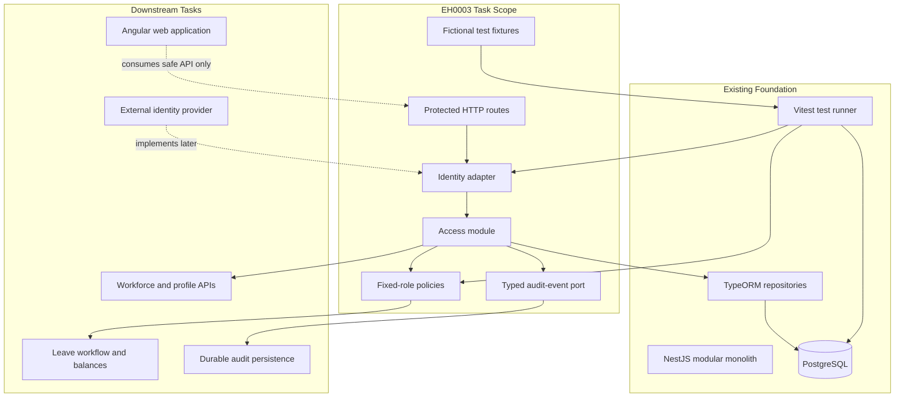

# Architectural Context: EH0003

## Component Diagram

## Components Involved

- **Protected HTTP routes**: Provide the minimal `/api/v1/access/me` and
  policy-proof surfaces used to verify the boundary.
- **Identity adapter**: Converts a signed-token-shaped identity or permitted
  local/test override into a provider-neutral subject.
- **Access module**: Resolves the subject to an active account, organization,
  employee, and role using server-owned data.
- **Fixed-role policies**: Enforce the explicit Employee, Manager, HR, and
  Administrator permission matrix, including direct-report and prohibition
  rules.
- **Typed audit-event port**: Carries sanitized authorization outcomes to the
  future durable Audit module.
- **TypeORM/PostgreSQL foundation**: Stores the minimum organization, account,
  role, and employee relationships through explicit migrations.
- **Angular web application**: Remains outside feature implementation; it may
  consume the protected API later but cannot authorize requests.

## Integration Points

- **HTTP → identity adapter**: Request credentials are translated into a
  provider-neutral identity; client organization/role fields are not trusted.
- **Access module → PostgreSQL**: Repositories resolve active account links,
  fixed roles, organization ownership, and manager relationships.
- **Access module → policy layer**: Resolved context is evaluated against one
  explicit E1 permission matrix.
- **Authorization → audit port**: Allowed and denied security-sensitive
  outcomes carry actor, organization, target, outcome, and correlation facts;
  durable persistence is deferred.
- **Future provider → adapter**: A real provider can implement the adapter
  contract without changing domain authorization.

## Test Boundaries

- **Unit tests**: Mock repositories and the audit port to test identity mapping,
  policy decisions, safe errors, and event shaping.
- **Integration tests**: Use disposable PostgreSQL and real migrations to test
  account links, fixed roles, organization isolation, and manager constraints.
- **HTTP tests**: Exercise routes with valid and adversarial identities and
  verify status codes, safe response fields, correlation IDs, and no mutation.
- **E2E tests**: No browser business journey is added; Angular remains a
  downstream consumer for later workforce/profile tasks.

## Downstream Impacts

- **Workforce/profile APIs**: Can consume a stable server-owned access context
  and organization-scoped repositories.
- **Leave workflow**: Can reuse fixed-role and manager-scope policies without
  introducing a second authorization mechanism.
- **Audit implementation**: Must implement the typed event port and durable
  append-only storage later.
- **Identity integration**: Must provide claim validation and account linking
  behind the adapter once a provider is selected.
- **Angular navigation**: Can become role-aware for presentation, while all
  permission enforcement remains in the API.

